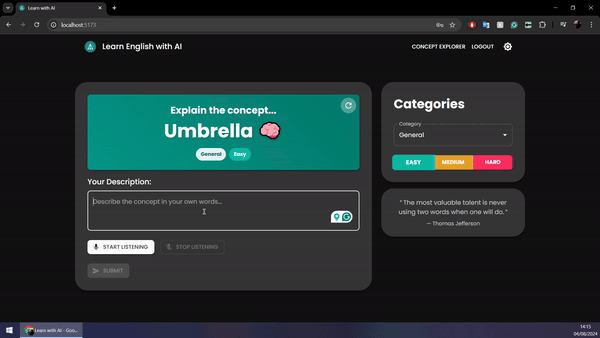

# Learn English with AI

## 📚 About

At the heart of "Learn English with AI" lies a powerful insight: true language mastery comes from explaining concepts in that language. This innovative web application designed to help people improve their English language skills.

Our platform challenges users to articulate randomly generated concepts in English, pushing beyond traditional learning methods. This unique approach not only bolsters vocabulary and writing skills but also enhances conceptual understanding and the ability to express complex ideas—the hallmarks of true language fluency.

By combining cutting-edge AI technology with this unique learning philosophy, we've created a platform that provides:

- Real-time, AI-powered feedback on your explanations
- Expert-level concept breakdowns to expand your understanding
- A continually refreshing set of concepts to keep you engaged and learning

Whether you're a beginner looking to build confidence in expressing ideas, or an advanced learner aiming to refine your explanatory skills, Learn English with AI offers a tailored, interactive experience to elevate your English proficiency.



## 🌟 Key Features

- **AI-Powered Concept Challenges**: Tackle a diverse array of randomly generated concepts, pushing the boundaries of your English expression.

- **Instant Feedback**: Receive real-time, nuanced evaluations of your explanations from our advanced AI, accelerating your learning curve.

- **Adaptive Difficulty Levels**: Progress at your own pace with easy, medium, or hard concepts, ensuring a perfectly tailored learning experience.

- **Voice-Activated Learning**: Harness the power of speech-to-text technology for a more natural and immersive practice session.

- **Expert AI Explanations**: Dive deep into each concept with comprehensive, AI-generated breakdowns that expand your understanding.

- **Motivational Quote Engine**: Stay inspired with a curated stream of thought-provoking quotes on language learning and personal growth.

- **Secure Auth**: Safeguard your learning journey with robust user authentication, including Google OAuth integration.

- **Dark/Light Mode**: Personalize your learning environment with theme options.

- **Responsive Design**: Enjoy a seamless learning experience across all devices - desktop, tablet, and mobile devices for learning on-the-go.

- **Continuous Content Refresh**: Enjoy an ever-expanding library of concepts, ensuring fresh challenges in every session.

## 🛠️ Tech Stack

- Frontend: React with TypeScript
- Backend: Node.js with Express
- Database: MongoDB
- Styling: Material-UI
- State Management: React Context API and custom hooks
- API Integration: Axios
- AI Integration: OpenAI API

## 🚀 Getting Started

### Prerequisites

- Node.js (v14 or later)
- npm (v6 or later)
- MongoDB instance

### Installation

1. Clone the repository:
   ```
   git clone https://github.com/your-username/learn-english-with-ai.git
   ```
2. Navigate to the project directory:
   ```
   cd learn-english-with-ai
   ```
3. Install dependencies for both frontend and backend:
   ```
   cd client && npm install
   cd ../backend && npm install
   ```
4. Set up environment variables:
   - Add necessary environment variables in the ".env" file (see Environment Variables section below)
5. Start the backend server:
   ```
   cd backend && npm run dev
   ```
6. Start the frontend development server:
   ```
   cd client && npm run dev
   ```

## Environment Variables

### Backend

To run the backend of this project, you need to set up the following environment variables:

```
PORT=
OPENAI_API_KEY=
MONGODB_URI=
JWT_SECRET=
GOOGLE_CLIENT_ID=
GOOGLE_CLIENT_SECRET=
GOOGLE_REDIRECT_URI=
CLIENT_URL=
```

### Frontend

For the frontend, set up these environment variables:

```
VITE_API_BASE_URL=
VITE_GOOGLE_CLIENT_ID=
VITE_GOOGLE_REDIRECT_URI=
```

## 🤝 Contributing

We welcome contributions to Learn English with AI! If you have suggestions for improvements or encounter any issues, please feel free to open an issue or submit a pull request.

1. Fork the project
2. Create your feature branch (`git checkout -b feature/AmazingFeature`)
3. Commit your changes (`git commit -m 'Add some AmazingFeature'`)
4. Push to the branch (`git push origin feature/AmazingFeature`)
5. Open a pull request

## 📜 License

MIT License

## 🙏 Acknowledgments

- OpenAI for providing the AI capabilities
- Google for OAuth integration
- Material-UI for the component library
- You, for your interest in improving English language skills!

---

Happy learning! 📚✨
